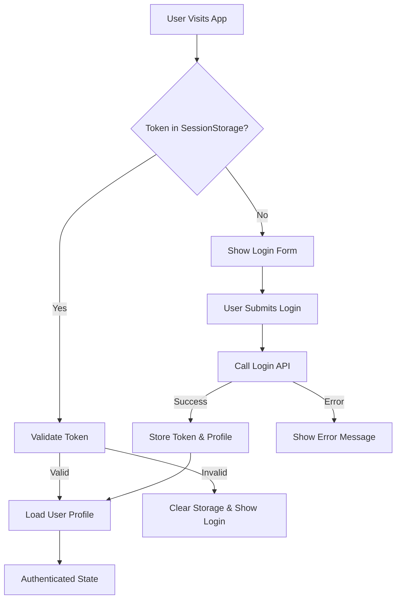
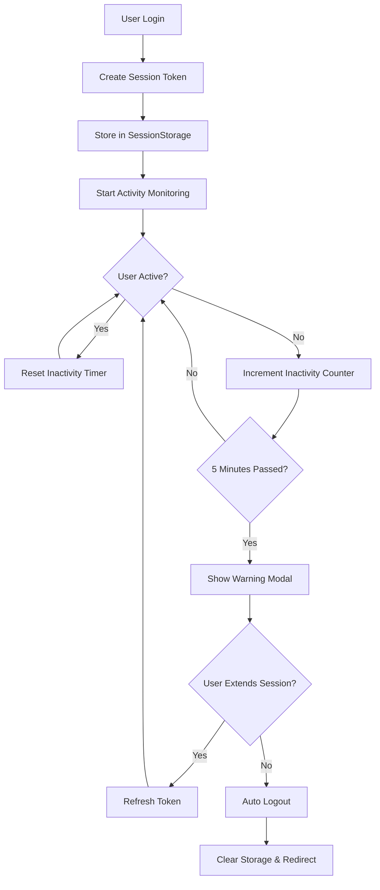
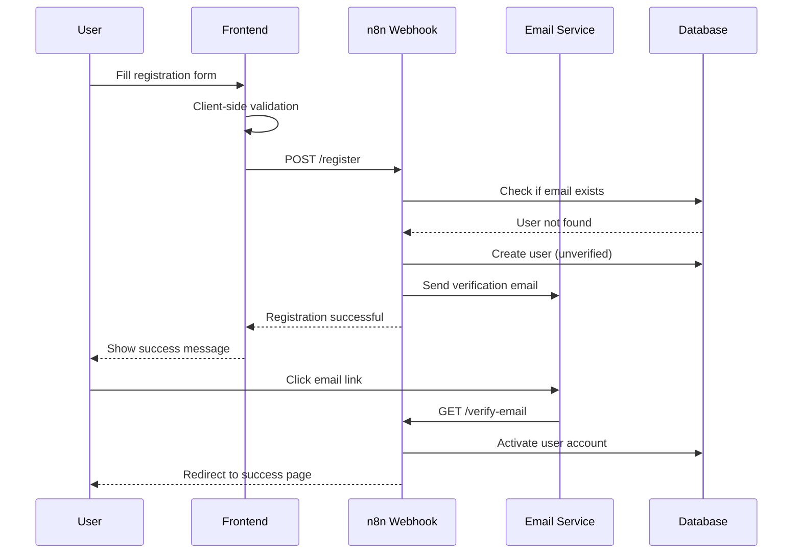
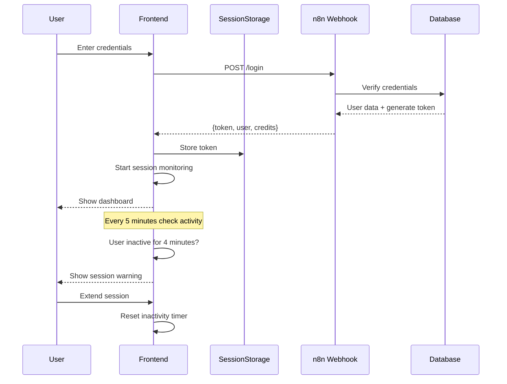

# System Architecture - Authentication Module

## 1. System Overview

### High-Level Architecture

```
┌─────────────────┐    ┌──────────────────┐    ┌─────────────────┐
│   Frontend      │    │   n8n Webhooks   │    │   Backend       │
│   (React/Vue)   │◄──►│   (Railway)      │◄──►│   Services      │
│                 │    │                  │    │                 │
│ • Auth Forms    │    │ • 5 Webhooks     │    │ • User DB       │
│ • State Mgmt    │    │ • Business Logic │    │ • Email Service │
│ • Session Mgmt  │    │ • Validation     │    │ • Token Service │
│ • Error Handling│    │ • Rate Limiting  │    │ • Audit Logs    │
└─────────────────┘    └──────────────────┘    └─────────────────┘
```

### Core Components

- **Frontend Application**: Single Page Application handling UI/UX
- **n8n Webhook Layer**: Business logic and API gateway
- **Backend Services**: Database, email, and authentication services
- **Session Management**: Token-based authentication with automatic refresh
- **Security Layer**: Rate limiting, validation, and error handling

---

## 2. Frontend Architecture

### Component Structure

```
src/
├── components/
│   ├── auth/
│   │   ├── LoginForm.vue
│   │   ├── RegisterForm.vue
│   │   ├── ResetPasswordForm.vue
│   │   ├── VerificationPage.vue
│   │   └── UserProfile.vue
│   ├── ui/
│   │   ├── LoadingSpinner.vue
│   │   ├── ErrorMessage.vue
│   │   ├── SuccessMessage.vue
│   │   └── Modal.vue
│   └── layout/
│       ├── Header.vue
│       └── Footer.vue
├── services/
│   ├── authService.js
│   ├── apiService.js
│   ├── sessionService.js
│   └── validationService.js
├── store/
│   ├── auth.js
│   ├── ui.js
│   └── index.js
├── utils/
│   ├── constants.js
│   ├── helpers.js
│   └── validators.js
└── router/
    └── index.js
```

### State Management Architecture

```javascript
// Auth Store Structure
{
  user: {
    isAuthenticated: false,
    profile: {
      name: '',
      email: '',
      credits: 0
    },
    token: null,
    tokenExpiry: null
  },
  ui: {
    loading: {
      login: false,
      register: false,
      resetPassword: false
    },
    errors: {
      login: null,
      register: null,
      resetPassword: null
    }
  },
  session: {
    lastActivity: null,
    warningShown: false,
    refreshInProgress: false
  }
}
```

### Authentication Flow



---

## 3. API Integration Layer

### n8n Webhook Endpoints

#### 1. User Login

- **URL**: `https://n8n-aipulse.up.railway.app/webhook-test/c0c755cf-deb8-4952-8f71-c88943566d72`
- **Method**: POST
- **Purpose**: Authenticate user credentials
- **Request Schema**:

```json
{
  "email": "string (required, email format)",
  "password": "string (required, min 8 chars)"
}
```

- **Response Schema**:

```json
{
  "success": true,
  "data": {
    "name": "string",
    "token": "string",
    "credits": "number",
    "expiresIn": "number (seconds)"
  }
}
```

#### 2. Password Reset Initiation

- **URL**: `https://n8n-aipulse.up.railway.app/webhook-test/014d8471-1c76-46c9-b15f-1009a131ce4f`
- **Method**: POST
- **Purpose**: Send password reset email
- **Request Schema**:

```json
{
  "email": "string (required, email format)",
  "newPassword": "string (required, password policy compliant)"
}
```

#### 3. Password Reset Activation

- **URL**: `https://n8n-aipulse.up.railway.app/webhook-test/5ca54e07-d8d5-45d6-bafe-642b209f234a`
- **Method**: POST
- **Purpose**: Activate new password via email link
- **Request Schema**:

```json
{
  "token": "string (from email link)",
  "email": "string"
}
```

#### 4. User Registration

- **URL**: `https://n8n-aipulse.up.railway.app/webhook-test/cc9d3a99-22b4-4cf3-97ee-33af0405451d`
- **Method**: POST
- **Purpose**: Create new user account
- **Request Schema**:

```json
{
  "email": "string (required, email format)",
  "password": "string (required, password policy)",
  "confirmPassword": "string (required, must match password)",
  "name": "string (required)",
  "phone": "string (optional, phone format)"
}
```

#### 5. Email Verification

- **URL**: `https://n8n-aipulse.up.railway.app/webhook-test/66086a0b-da58-4fa5-9132-242db2618345`
- **Method**: POST
- **Purpose**: Verify email address after registration
- **Request Schema**:

```json
{
  "token": "string (from email link)",
  "email": "string"
}
```

### API Service Layer

```javascript
class ApiService {
  constructor() {
    this.baseRetryConfig = {
      maxRetries: 3,
      backoffFactor: 2,
      initialDelay: 1000,
    };
  }

  async makeRequest(endpoint, data, options = {}) {
    const config = {
      method: "POST",
      headers: {
        "Content-Type": "application/json",
        ...options.headers,
      },
      body: JSON.stringify(data),
      timeout: 30000,
    };

    return this.retryRequest(endpoint, config);
  }

  async retryRequest(url, config) {
    // Exponential backoff retry logic
    // Network error handling
    // Timeout management
  }
}
```

---

## 4. Security Architecture

### Authentication Security

```javascript
// Password Policy
const PASSWORD_POLICY = {
  minLength: 8,
  requireUppercase: true,
  requireLowercase: true,
  requireNumbers: true,
  requireSpecialChars: true,
  specialChars: "!@#$%^&*()_+-=[]{}|;:,.<>?",
};

// Token Management
const TOKEN_CONFIG = {
  storage: "sessionStorage", // Clears on browser close
  expiryBuffer: 120000, // 2 minutes before actual expiry
  refreshThreshold: 300000, // 5 minutes before expiry
  maxSessionDuration: 28800000, // 8 hours maximum
};
```

### Rate Limiting Strategy

```javascript
const RATE_LIMITS = {
  login: {
    maxAttempts: 5,
    windowMs: 900000, // 15 minutes
    blockDurationMs: 900000, // 15 minutes
  },
  register: {
    maxAttempts: 2,
    windowMs: 600000, // 10 minutes
    blockDurationMs: 600000, // 10 minutes
  },
  resetPassword: {
    maxAttempts: 3,
    windowMs: 3600000, // 1 hour
    blockDurationMs: 3600000, // 1 hour
  },
  ipBlocking: {
    maxViolations: 10,
    blockDurationMs: 3600000, // 1 hour
  },
};
```

### Security Headers & CORS

```javascript
const SECURITY_CONFIG = {
  cors: {
    origin: process.env.FRONTEND_URL,
    credentials: true,
    optionsSuccessStatus: 200,
  },
  headers: {
    "X-Content-Type-Options": "nosniff",
    "X-Frame-Options": "DENY",
    "X-XSS-Protection": "1; mode=block",
    "Strict-Transport-Security": "max-age=31536000; includeSubDomains",
  },
};
```

---

## 5. Session Management

### Session Lifecycle



### Multi-Tab Synchronization

```javascript
class SessionManager {
  constructor() {
    this.storageKey = "auth_session";
    this.broadcastChannel = new BroadcastChannel("auth_channel");
    this.setupStorageListener();
    this.setupBroadcastListener();
  }

  syncAcrossTabs() {
    // Broadcast authentication state changes
    // Handle storage events for cross-tab sync
    // Manage concurrent session refresh
  }

  handleTabClose() {
    // Clean up resources
    // Broadcast tab closure
    // Manage last active tab logic
  }
}
```

### Token Refresh Mechanism

```javascript
class TokenRefreshService {
  constructor() {
    this.refreshInProgress = false;
    this.refreshPromise = null;
  }

  async scheduleRefresh(token) {
    const expiryTime = this.parseTokenExpiry(token);
    const refreshTime = expiryTime - 2 * 60 * 1000; // 2 minutes before expiry

    setTimeout(() => {
      this.silentRefresh();
    }, refreshTime - Date.now());
  }

  async silentRefresh() {
    // Prevent multiple concurrent refreshes
    // Handle refresh failures gracefully
    // Update token across all tabs
  }
}
```

---

## 6. Error Handling Architecture

### Error Classification

```javascript
const ERROR_TYPES = {
  VALIDATION: "validation",
  NETWORK: "network",
  AUTH: "authentication",
  RATE_LIMIT: "rate_limit",
  SERVER: "server",
  TIMEOUT: "timeout",
};

const ERROR_MESSAGES = {
  USER_NOT_FOUND:
    "Nie znaleziono użytkownika o podanym adresie email. Sprawdź dane logowania lub zarejestruj się.",
  INVALID_PASSWORD: "Nieprawidłowe hasło. Sprawdź hasło i spróbuj ponownie.",
  NETWORK_ERROR: "Wystąpił problem z połączeniem. Spróbuj ponownie za chwilę.",
  RATE_LIMIT_EXCEEDED: "Zbyt wiele prób. Spróbuj ponownie za {minutes} minut.",
  SESSION_EXPIRED: "Sesja wygasła. Zaloguj się ponownie.",
  EMAIL_ALREADY_EXISTS:
    "Konto z tym adresem email już istnieje. Spróbuj się zalogować lub zresetuj hasło.",
};
```

### Error Recovery Strategies

```javascript
class ErrorRecoveryService {
  constructor() {
    this.retryStrategies = new Map();
    this.fallbackStrategies = new Map();
  }

  async handleError(error, context) {
    switch (error.type) {
      case ERROR_TYPES.NETWORK:
        return this.handleNetworkError(error, context);
      case ERROR_TYPES.RATE_LIMIT:
        return this.handleRateLimitError(error, context);
      case ERROR_TYPES.AUTH:
        return this.handleAuthError(error, context);
      default:
        return this.handleGenericError(error, context);
    }
  }

  async handleNetworkError(error, context) {
    // Implement exponential backoff retry
    // Cache failed requests for later retry
    // Provide offline mode fallback
  }
}
```

---

## 7. Performance Architecture

### Bundle Optimization

```javascript
// Code Splitting Strategy
const routes = [
  {
    path: "/login",
    component: () => import("./components/auth/LoginForm.vue"),
  },
  {
    path: "/register",
    component: () => import("./components/auth/RegisterForm.vue"),
  },
];

// Lazy Loading
const LazyComponent = {
  template: '<div><component :is="component" /></div>',
  data() {
    return { component: null };
  },
  async mounted() {
    this.component = await import("./HeavyComponent.vue");
  },
};
```

### Caching Strategy

```javascript
class CacheService {
  constructor() {
    this.cache = new Map();
    this.cacheConfig = {
      userProfile: { ttl: 300000 }, // 5 minutes
      systemConfig: { ttl: 900000 }, // 15 minutes
      validationRules: { ttl: 1800000 }, // 30 minutes
    };
  }

  async get(key, fetchFn) {
    const cached = this.cache.get(key);
    if (cached && !this.isExpired(cached)) {
      return cached.data;
    }

    const data = await fetchFn();
    this.set(key, data);
    return data;
  }
}
```

### Performance Monitoring

```javascript
const PERFORMANCE_METRICS = {
  API_RESPONSE_TIME: "api_response_time",
  COMPONENT_RENDER_TIME: "component_render_time",
  BUNDLE_LOAD_TIME: "bundle_load_time",
  FORM_VALIDATION_TIME: "form_validation_time",
};

class PerformanceMonitor {
  constructor() {
    this.metrics = new Map();
  }

  startTimer(metric) {
    this.metrics.set(metric, performance.now());
  }

  endTimer(metric) {
    const startTime = this.metrics.get(metric);
    const duration = performance.now() - startTime;
    this.reportMetric(metric, duration);
  }
}
```

---

## 8. Accessibility Architecture

### WCAG 2.1 Compliance

```javascript
const A11Y_CONFIG = {
  focusManagement: {
    trapFocus: true,
    returnFocus: true,
    skipLinks: true,
  },
  announcements: {
    liveRegion: "polite",
    errorAnnouncement: "assertive",
    statusAnnouncement: "polite",
  },
  colorContrast: {
    normalText: 4.5,
    largeText: 3.0,
    nonTextElements: 3.0,
  },
};
```

### Keyboard Navigation

```javascript
class KeyboardNavigationManager {
  constructor() {
    this.focusableElements = [
      "button",
      "input",
      "select",
      "textarea",
      "a[href]",
      '[tabindex]:not([tabindex="-1"])',
    ];
  }

  setupFocusTrap(container) {
    // Implement focus trapping for modals
    // Handle Escape key to close
    // Manage Tab/Shift+Tab navigation
  }

  announceToScreenReader(message, priority = "polite") {
    const announcement = document.createElement("div");
    announcement.setAttribute("aria-live", priority);
    announcement.setAttribute("aria-atomic", "true");
    announcement.className = "sr-only";
    announcement.textContent = message;

    document.body.appendChild(announcement);
    setTimeout(() => document.body.removeChild(announcement), 1000);
  }
}
```

---

## 9. Monitoring & Analytics

### Event Tracking

```javascript
const ANALYTICS_EVENTS = {
  // Authentication Events
  LOGIN_ATTEMPT: "login_attempt",
  LOGIN_SUCCESS: "login_success",
  LOGIN_FAILURE: "login_failure",

  // Registration Events
  REGISTER_ATTEMPT: "register_attempt",
  REGISTER_SUCCESS: "register_success",
  EMAIL_VERIFICATION_SENT: "email_verification_sent",
  EMAIL_VERIFIED: "email_verified",

  // Password Reset Events
  PASSWORD_RESET_REQUESTED: "password_reset_requested",
  PASSWORD_RESET_COMPLETED: "password_reset_completed",

  // Session Events
  SESSION_EXPIRED: "session_expired",
  SESSION_EXTENDED: "session_extended",
  LOGOUT: "logout",

  // Error Events
  RATE_LIMIT_HIT: "rate_limit_hit",
  NETWORK_ERROR: "network_error",
  VALIDATION_ERROR: "validation_error",
};
```

### Health Monitoring

```javascript
class HealthMonitor {
  constructor() {
    this.healthChecks = {
      apiConnectivity: this.checkApiHealth,
      sessionValidity: this.checkSessionHealth,
      performanceMetrics: this.checkPerformanceHealth,
    };
  }

  async runHealthChecks() {
    const results = {};
    for (const [check, fn] of Object.entries(this.healthChecks)) {
      try {
        results[check] = await fn();
      } catch (error) {
        results[check] = { status: "error", error: error.message };
      }
    }
    return results;
  }
}
```

---

## 10. Deployment Architecture

### Environment Configuration

```javascript
const ENV_CONFIG = {
  development: {
    apiBaseUrl: "https://n8n-aipulse.up.railway.app",
    debug: true,
    analytics: false,
    rateLimiting: false,
  },
  staging: {
    apiBaseUrl: "https://n8n-aipulse.up.railway.app",
    debug: false,
    analytics: true,
    rateLimiting: true,
  },
  production: {
    apiBaseUrl: "https://n8n-aipulse.up.railway.app",
    debug: false,
    analytics: true,
    rateLimiting: true,
    errorReporting: true,
  },
};
```

### Build & Deployment Pipeline

```yaml
# CI/CD Pipeline Structure
stages:
  - build
  - test
  - security-scan
  - deploy-staging
  - e2e-tests
  - deploy-production

build:
  - Bundle optimization
  - Asset minification
  - Service worker generation
  - Environment variable injection

security-scan:
  - Dependency vulnerability check
  - Code security analysis
  - OWASP compliance check
  - Secret detection
```

---

## 11. Technology Stack

### Frontend Stack

- **Framework**: Vue.js 3 / React 18
- **State Management**: Vuex/Pinia or Redux Toolkit
- **Routing**: Vue Router / React Router
- **HTTP Client**: Axios
- **Validation**: Joi / Yup
- **Testing**: Jest + Vue Test Utils / React Testing Library
- **E2E Testing**: Cypress
- **Bundler**: Vite / Webpack 5
- **CSS Framework**: Tailwind CSS
- **Accessibility**: Vue A11y / React A11y

### DevOps & Monitoring

- **CI/CD**: GitHub Actions / GitLab CI
- **Hosting**: Vercel / Netlify
- **Monitoring**: Sentry for error tracking
- **Analytics**: Google Analytics / Mixpanel
- **Performance**: Lighthouse CI
- **Security**: OWASP ZAP

---

## 12. Data Flow Diagrams

### User Registration Flow



### Login & Session Management Flow


